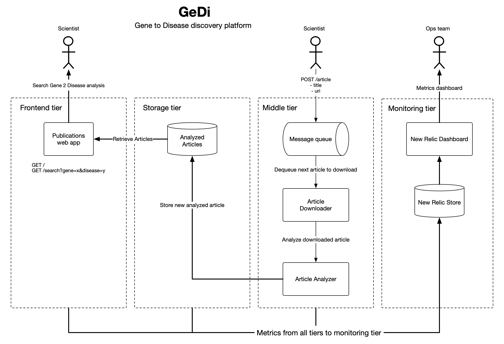
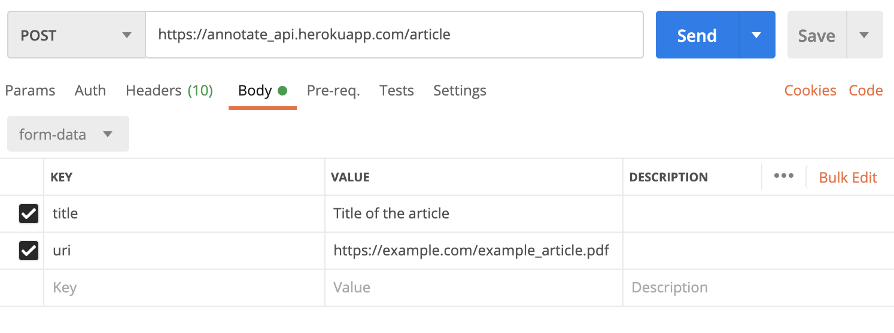
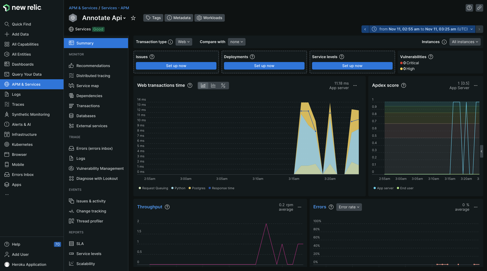
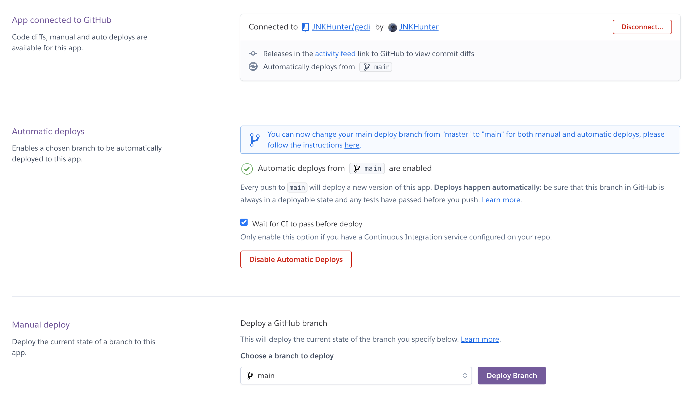

# GeDi: Gene to Disease Discovery
Scientists spend hours reading the most recent scientific literature to gain state of the art knowledge of gene to disease relationships. To help scientists discover relevant literature faster, GeDi will be developed to analyze new scientific literature at the instant of publication and extract gene to disease relationships that co-occur in that publication. GeDi then displays the gene to disease relationships of scientific interest to scientists along with a link back to the original publication. There are similar applications available commercially, but GeDi gives scientists a competitive advantage by providing up to the minute and personalized updates of newly discovered gene to disease relationships.

## System requirements
### User requirements
* System must allow end users via a UI application to search for a gene and find all related diseases we have found from scientific literature.

* System must provide an endpoint that allows for passing the URL location of a scientific document for the system to collect, parse, annotate, and make available to the search application.

* An NLP or other text-mining analysis process must be executed on collected scientific literature to extract gene to disease relationships.

* System must store all annotations found in a scientific document, along with associated metadata (article title, link back to article, etc)

### Non-functional requirements
* System must be well tested with comprehensive unit and integration test suites.

* Production environment must be suitable for future scaling needs. 

* Continuous integration and delivery must be supported. Full test suites must be executed successfully before branch merges are allowed. Successful merging into the main branch deploys the application to production.

* The analysis application consumes large resources, so the system must provide production monitoring of the analysis tier so that capacity and cost can be closely monitored.

* Callers of the analysis application shouldn't have to wait for analysis to complete to get a result from the analysis api. The API should respond instancty and process articles in the background asynchronously.

## Application architecture


The application's logical architecture is split into 4 tiers, front-end, storage, middle, and monitoring. The front-end application serves article analysis stored in the storage tier. The middle tier handles all the business logic and long running processes of the application including downloading and analyzing articles. The monitoring tier gives us a window into our application's usage and performance through a dashboard.

I broke the GeDi system into two applications:
* [Web app](https://github.com/JNKHunter/gedi)
* [Download and Analyze](https://github.com/JNKHunter/gedi_analyzer)

## Technology stack and justifications
I chose Python as the programming language because of the rich machine learning libraries available. For the NLP analyzer, I chose [SciSpacy](https://allenai.github.io/scispacy/) for it's robust medical named entity recognition features that were perfect for analyzing biology articles.

There were a lot of requirements to cover in a short period of time, so I chose Flask as the the web application framework for it's flexibility, speed of development, and testing tools.

For persistence, I chose PostgreSQL because I needed a relational data store and PostgreSQL is very well supported and scalable.

I chose RabbitMQ for messaging because while other message queues like Kafka are very good for high throughput data ingest applications, a lightweight system like Rabbit would fit the requirements nicely for inter-application messaging and coordinating long running processes like text analysis.

## Grading Rubric
Below is the documentation outlining how I implemented each part of the grading rubric.

### :white_check_mark: Web application
Users interact with GeDI data through a simple search UI. The web application's only responsibility is to respond to user search requests. All business logic is handled in the middle tier, and persistence and data integrity is handled in the storage tier. I used the Flask Python library to provide a sufficient and lightweight web framework for this application. I've used Heroku for hosting.

The deployed web application [can be found here](https://gedi-d8de393fb142.herokuapp.com/)

The web application code can be [found here](https://github.com/JNKHunter/gedi/tree/main/app)

### :white_check_mark: Data collection/parsing
The data collector is bundled with the data analysis application, and can be [found here](https://github.com/JNKHunter/gedi_analyzer/tree/main). The data collection app [downloads](https://github.com/JNKHunter/gedi_analyzer/tree/main/downloader) and then [parses](https://github.com/JNKHunter/gedi_analyzer/tree/main/parser) the pdf into plaintext before passing to the SciSpacy analyzer. Downloading, parsing, and analyzing a pdf is a long running task, so we use event collaboration messaging to [process the job in the background](https://github.com/JNKHunter/gedi_analyzer/blob/main/main.py#L46) using [Celery](https://docs.celeryq.dev/en/stable/getting-started/introduction.html) and [RabbitMQ](https://www.rabbitmq.com/). More on the even collaboration messaging implementation in the following sections.

### :white_check_mark: Data analyzer
After downloading and parsing a pdf, we pass the PDF contents along with the newly created article_id over to the [SpacyAnalyzer](https://github.com/JNKHunter/gedi_analyzer/blob/main/spacy_analyzer/SpacyAnalyzer.py). The SpacyAnalyzer executes the `en_ner_bionlp13cg_md` model over the parsed pdf, and extracts the gene to disease relationships. The Scispacy extracts many types of biological entities, so I've filtered on only genes and diseases. Extracted gene to disease relationships are then saved in PostgreSQL along with the article_id for future reference.

### :white_check_mark: Unit tests
I built a suite of unit tests built using the Pytest framework. The tests for the webapp can be [found here](https://github.com/JNKHunter/gedi_analyzer/tree/main/tests), and the suite of tests for the analyzer/downloader/parser can be [found here](https://github.com/JNKHunter/gedi_analyzer/tree/main/tests).

I found that the user requirements were very testable, and I was able to produce tests for the web ui, data downloader, analyzer, database, and NLP processes.

### :white_check_mark: Storage
This is the tier where references to literature, associated metadata (title, uri etc), and annotations we extract from the literature is persisted and then used by the web application for retrieval. PostgreSql will be sufficient for our scaling needs, and is supported on all cloud providers including Heroku. I've implemented object relational mapping using SQLAlchemy library and database migrations using the Alembic library.

#### :white_check_mark: Articles table:
Stores each article that was downloaded and analyzed by the analyzer application.

* title: Title of the analyzed article
* uri: Location of the analyzed article

#### :white_check_mark: Predications table:
Stores each predication found and links the NLP discovery back to the article.

* gene: Left side of the extracted relationship. Left side will always be a gene.
* disease: Right side of the extracted relationship. Right side will always be a type of cancer.
* pred_type: The relationship type. Co-occurrence means that the detected gene and disease appear in the same sentence.
* article_id: Foreign key for the Article the predication was found in.


### :white_check_mark: Rest API endpoint:
A POST API has been set up using the Flask Restful framework to allow submission of an article to be downloaded, parsed, and analyzed. POST API can be [found here](https://github.com/JNKHunter/gedi_analyzer/blob/main/main.py#L36). The API currently supports only PDF files, but can be expanded to include PPT, web pages, and other types of formatted text content.



### :white_check_mark: Product environment:
Heroku is used to host the production environment. Heroku provides us a platform for scalable storage, compute, messaging as well as storing application secrets, environment variables, and continuous deployment. The URL for the production web application can be [found here](https://gedi-d8de393fb142.herokuapp.com/).

### :white_check_mark: Integration tests:
For the webapp, there is an integration test that tests integration of the data store, the search page, and the results page. Testing of the search submission page to ensure the gene "TP53" is present, and follows up with a check on the search results page for the expected results from the data store. For enabling integrations tests, I loaded some test data into an in-memory SQLite instance to test persistence from page to page. Integration test can be [found here](https://github.com/JNKHunter/gedi/blob/main/tests/test_results_integration.py).

### :white_check_mark: Using mock objects, fakes, or spys:
For fast execution of unit tests that have a network dependency, I used the MagicMock framework to mock the download network call. The mock object implementation can be [found here](https://github.com/JNKHunter/gedi_analyzer/blob/main/tests/test_downloader.py)

### :white_check_mark: Continuous integration:
I used GitHub actions to fulfill the continuous integration requirement. I set up a branching workflow with a single main branch that can only be merged into via pull request, and then only when all of the unit and integration tests pass for the respective apps. CI configuration for the gedi webapp can be [found here](https://github.com/JNKHunter/gedi/blob/main/.github/workflows/ci.yaml), and the CI configuration for the gedi analyzer app can be [found here](https://github.com/JNKHunter/gedi_analyzer/blob/main/.github/workflows/ci.yaml).

### :white_check_mark:  Production monitoring instrumenting
New Relic was used for production monitoring. After activating the New Relic service on Heroku, I installed the New Relic Python library, and activated the New Relic agent in my Procfile [found here](https://github.com/JNKHunter/gedi_analyzer/blob/main/Procfile). New Relic allows for monitoring requests, throughput, errors, CPU/memory usage, and other useful metrics.



### :white_check_mark: Event collaboration messaging
This was the most fun part of building the application. The analyzer application can take up to 30 seconds to process and analyze a large document. To improve response times, I implemented a background worker using [Celery](https://docs.celeryq.dev/en/stable/getting-started/introduction.html) and [RabbitMq](https://www.rabbitmq.com/). Celery works very well with RabbitMq, and both are supported on the Heroku platform as a persistent worker and add-on respectively. When an article is submitted via the [POST api](https://github.com/JNKHunter/gedi_analyzer/blob/main/main.py#L36), the API immediately responds with an article id that the caller can use to poll and check if the job has completed. At the same time I submit the job into the Rabbit queue using the Celery `.delay()` method to be picked up by the next available Celery worker and then processed. According to the New Relic instrumentation, it takes on average 14 seconds to process an an article. 

### :white_check_mark: Continuous delivery
Continuous delivery is achieved by connecting the main branches of each application with a Heroku application. When all tests pass and code is integrated into the main branch, Github signals to Heroku that the main branch was updated, and a process I set up in Heroku deploys the newly built app into the production environment. Screenshot of the CD configuration can be seen below.


## Steps to run the entire system locally:
### Clone both Git repos:
`git clone git@github.com:JNKHunter/gedi.git`

then

`git clone git@github.com:JNKHunter/gedi_analyzer.git`

### Set environment variables
Set the following environment variables:
`export DATABASE_URL=sqlite:////path/to/your/dev/db/location.db`
`export MESSAGE_BROKER=amqp://guest@localhost//`

### Docker
With docker/docker compose installed, start up the docker containers in a new window from the project root directory. This command will start up a PostgreSQL server locally for testing, psqladmin, and RabbitMQ
`docker compose up`

### Python and requirements
The gedi project uses Python 3.11.5
The gedi_analyzer uses Python 3.9.18

Create two separate conda or virtualenv environments for each project using the corresponding Python versions. Any Python commands in these instructions that are run from either the gedi or gedi_analyzer application directories are assumed to be run in those virtualenv or conda environments.

After creating the environments, install the requred packages for each project using requrements.txt in the respective projects.

### Database gedi migrations
To migrate the database, cd into the gedi directory and run the migration script
`cd gedi`
In a separate terminal window in the project root directory
```flask db migrate```

### Running gedi tests
From the gedi directory
`pytest`

### Running gedi_analyzer tests
Form the gedi_analyzer directory
`python -m unittest discover -s tests -p "test_*.py"`

### Run the web UI
From the gedi directory
`flask run`

### Run the analyzer POST api
From the gedi_analyzer directory
`flask --app main run -p 5001`

### Run the Celery background worker
From the gedi_analyzer directory
`celery -A tasks worker --loglevel=INFO`